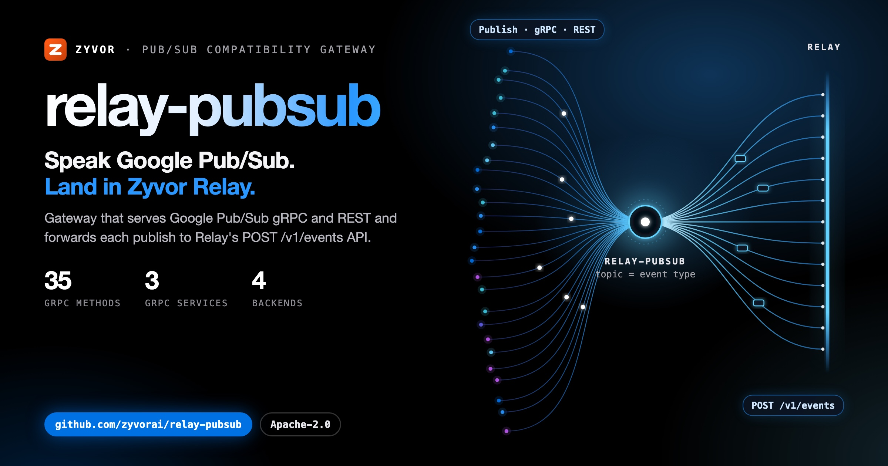
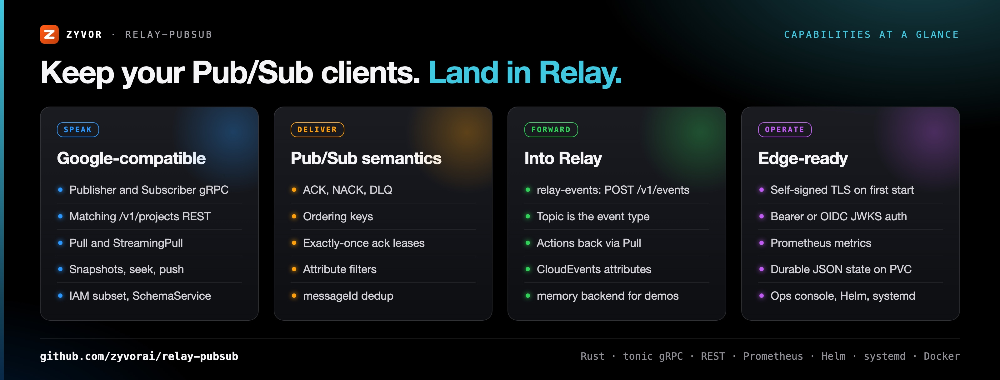
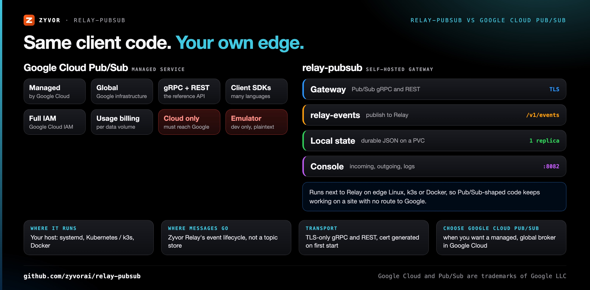
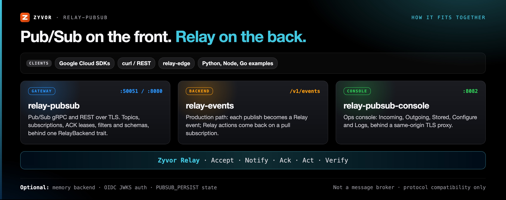

<div align="center">

# relay-pubsub

[](https://github.com/zyvorai/relay-pubsub/actions/workflows/ci.yml)
[](LICENSE)
[](Cargo.toml)
[](https://github.com/zyvorai/relay-pubsub/releases)
[](https://github.com/zyvorai/relay-pubsub/pkgs/container/relay-pubsub)
[](https://zyvorai.github.io/relay-pubsub/)

[](https://zyvor.dev/schedule?utm_source=github&utm_medium=relay-pubsub&utm_campaign=readme_hero)
[](https://zyvor.dev/poc?utm_source=github&utm_medium=relay-pubsub&utm_campaign=readme_hero)
[](#quickstart)



### Speak Google Pub/Sub. Land in Zyvor Relay.

**Google Cloud Pub/Sub compatibility for [Zyvor Relay](https://github.com/zyvorai/relay).** Speak familiar Pub/Sub gRPC and REST. The gateway handles translation, TLS, metrics, and — with `RELAY_BACKEND=relay-events` — forwards every publish to Relay's real **`POST /v1/events`** API.

**Pub/Sub gRPC + REST** · **Publisher, Subscriber and SchemaService** · **TLS-only, no reverse proxy** · **4 backends** · **Rust, Apache 2.0**

📖 **[Read the full docs](https://zyvorai.github.io/relay-pubsub/)** — install, testing, relay-events backend, and architecture.

</div>

---

## What's new

| | |
|---|---|
| **Subscription filters** (Unreleased) | Google-style attribute filters (`attributes:key`, `=`, `!=`, `hasPrefix`, `AND` / `OR` / `NOT`); non-matching messages are auto-acknowledged. |
| **Schemas, dedup and CloudEvents** (Unreleased) | Publish-time JSON schema enforcement, dedup by `messageId` or `idempotency_key`, and CloudEvents 1.0 attributes stamped on publish. |
| **Native gRPC backend scaffold** (Unreleased) | `RELAY_BACKEND=grpc` keeps the backend trait ready for a Relay gRPC client; the data plane is not implemented yet. |
| **Ops console in Kubernetes** (0.4.0) | Helm `console.enabled`, image `ghcr.io/zyvorai/relay-pubsub-console`, PVC auto-create for restart durability. |
| **Client conformance matrix** (0.4.0) | `scripts/client-matrix.sh` with REST, conformance, Python, Node and Go lanes, run in CI. |
| **Wider Pub/Sub surface** (0.3.0) | Update APIs, snapshots and seek, push, IAM subset, SchemaService, ordering keys, exactly-once ack leases, durable JSON state. |

Full history: [CHANGELOG.md](CHANGELOG.md).

---

## Why relay-pubsub

| When this happens… | relay-pubsub gives you… |
|---|---|
| Your edge apps and SDKs speak Google Pub/Sub, but Relay's API is event-lifecycle shaped | Full Publisher/Subscriber gRPC and matching REST on the front, Relay's `POST /v1/events` on the back |
| The site has no reliable route to Google Cloud | A self-hosted gateway on edge Linux (systemd), Kubernetes / k3s or Docker, next to Relay |
| Every service needs a reverse proxy just for TLS | TLS-only gRPC and REST, with a self-signed certificate generated on first start (`PUBSUB_TLS_SAN`) |
| Consumers expect real Pub/Sub delivery semantics | Explicit ACK, NACK via zero deadline, DLQ after max attempts, ordering keys, exactly-once ack leases, seek |
| Relay needs to send actions back to the edge | Relay actions delivered on a pull subscription (`Pull` / `StreamingPull`) |
| You want a demo or CI run without the whole stack | The `memory` backend: an instant local round-trip, no Relay needed |



---

## relay-pubsub vs Google Cloud Pub/Sub



relay-pubsub does not replace Google's service; it lets Pub/Sub-shaped client code talk to a self-hosted Relay stack instead.

| | **relay-pubsub** | **Google Cloud Pub/Sub** (managed) |
|---|---|---|
| Where it runs | Your host: systemd, Kubernetes / k3s, Docker | Google Cloud |
| Where messages go | Zyvor Relay's event lifecycle (`relay-events`), or `memory` for demos | Google's managed topic and subscription store |
| Wire API | Publisher, Subscriber and SchemaService gRPC, `/v1/projects/...` REST | The reference gRPC and REST API |
| Transport | TLS-only, self-signed cert on first start or your own | Google-managed TLS endpoints |
| Access control | Optional static bearer or OIDC JWKS; IAM subset | Google Cloud IAM |
| Scale-out | Single replica with a PVC today; multi-replica cursors are planned in Relay core | Managed and global |
| **Choose Google Cloud Pub/Sub when** | | You want a managed, global broker in Google Cloud and your sites can reach it |

---

## How it fits together



```text
  Google SDK / curl          relay-pubsub              Zyvor Relay
  ─────────────────          ──────────────            ───────────

  Publish "irrigation.    →   topic = event type   →   Accept
  required"                    self-signed HTTPS        Notify · Act
  Pull / StreamingPull    ←   action queue          ←   /v1/actions
```

Relay's API is **event-lifecycle shaped** — not topics and subscriptions. Edge apps, SDKs, and ops tooling speak **Google Pub/Sub**.

relay-pubsub sits in the middle: full Publisher/Subscriber surface on the front, `RelayBackend` on the back. Production path: **`relay-events`** → Relay's shipped API. Demo path: **`memory`** → instant local round-trip.

Pair with **[relay-edge](https://github.com/zyvorai/relay-edge)** for stamped farm events and industrial simulators that publish through the same gateway.

Runs on **edge Linux (systemd)**, **Kubernetes / k3s**, or **Docker**.

| Component | Port | Role |
|---|---|---|
| Gateway (`ghcr.io/zyvorai/relay-pubsub`) | `50051` (gRPC), `8080` (REST) | Pub/Sub gRPC and REST over TLS, `RelayBackend` translation |
| Console (`ghcr.io/zyvorai/relay-pubsub-console`) | `8082` | Ops console: Incoming / Outgoing / Stored / Configure / Logs |

Ports are the Helm chart defaults in [deploy/helm/relay-pubsub/values.yaml](deploy/helm/relay-pubsub/values.yaml). Boundaries, HA and tenant model: [docs/ARCHITECTURE.md](docs/ARCHITECTURE.md).

---

## Quickstart

```bash
git clone https://github.com/zyvorai/relay-pubsub.git
cd relay-pubsub
docker compose up --build
make ci
bash scripts/smoke.sh          # curl -k, self-signed TLS
```

Or pull the release image:

```bash
docker pull ghcr.io/zyvorai/relay-pubsub:0.4.0
docker run --rm -p 8080:8080 -p 50051:50051 \
  -e RELAY_BACKEND=memory ghcr.io/zyvorai/relay-pubsub:0.4.0
```

**Install** → [docs/INSTALL.md](docs/INSTALL.md) · **Test** → [docs/TESTING.md](docs/TESTING.md) · **First publish** → [docs/GETTING_STARTED.md](docs/GETTING_STARTED.md)

**Images:** `ghcr.io/zyvorai/relay-pubsub:0.4.0` · `ghcr.io/zyvorai/relay-pubsub-console:0.4.0`  
**Current release:** [v0.4.0](https://github.com/zyvorai/relay-pubsub/releases/tag/v0.4.0)

---

## Backends

| Backend | Relay needed? | Use case |
|---------|---------------|----------|
| `memory` | No | CI, k3s smoke, demos, offline edge |
| `http` | Yes (invented API) | Legacy — prefer relay-events |
| **`relay-events`** | Yes (real API) | **Production, relay-edge** |
| `grpc` | Stub | Scaffold until a Relay gRPC proto lands |

```bash
export RELAY_BACKEND=relay-events
export RELAY_BASE_URL=https://relay.example.com:8443
export RELAY_AUTH_TOKEN=<jwt>
export RELAY_TLS_INSECURE=1    # if Relay uses self-signed TLS
cargo run
```

## What's implemented

<details>
<summary><strong>Google-compatible surface</strong> (click to expand)</summary>

**gRPC:** Create/Update/Get/List/Delete topics & subscriptions, Publish, Pull, StreamingPull, Acknowledge, ModifyAckDeadline, Seek (time + snapshot), Snapshots, ModifyPushConfig, ListTopicSubscriptions, IAM subset, SchemaService.

**REST:** Matching `/v1/projects/...` admin + data plane, including pagination (`pageSize` / `pageToken`), PATCH updates, snapshots, schemas, IAM.

**Semantics (memory / relay-events local store):** explicit ACK, NACK via zero deadline, DLQ after max attempts, ordering keys, exactly-once ack leases, retry backoff, timestamp + snapshot seek, push dispatcher, optional durable JSON state (`PUBSUB_PERSIST`), Prometheus metrics, attribute filters, schema-bound publish, messageId dedup, CloudEvents attribute projection.

**Ops:** `/admin/v1/inventory`, `/admin/v1/logs`, `/admin/v1/push-config`, product console (Incoming / Outgoing / Stored / Logs).

</details>

## TLS — no reverse proxy needed

gRPC and REST are **TLS-only**. First start generates a self-signed cert at `/var/lib/relay-pubsub/tls/` (configurable). Set `PUBSUB_TLS_SAN` before first start to embed your host IP and service DNS names.

```bash
curl -k https://localhost:8080/healthz
grpcurl -insecure localhost:50051 list
```

See [docs/GETTING_STARTED.md](docs/GETTING_STARTED.md) for the `PUBSUB_EMULATOR_HOST` caveat with Google's plaintext emulator mode.

## Deploy

| Target | Command |
|--------|---------|
| **Linux host (systemd)** | `make deploy-remote H=<host> U=<user>` |
| **Ops console** | `bash scripts/deploy-console-remote.sh <HOST> <USER>` |
| **Local k3s** | `bash deploy/scripts/deploy-k3s.sh` |
| **Helm** | `helm upgrade --install … deploy/helm/relay-pubsub` |
| **k8s + relay-edge** | From relay-edge: `./deploy/scripts/deploy-k8s-remote.sh <HOST>` |
| **GHCR** | `docker pull ghcr.io/zyvorai/relay-pubsub:0.4.0` |

```bash
BASE=https://<host>:8081 bash scripts/smoke.sh
BASE=https://<host>:8081 bash scripts/conformance-smoke.sh
BASE=https://<host>:8081 bash scripts/smoke-relay-events.sh
```

## Documentation

| Guide | What's inside |
|-------|---------------|
| [zyvorai.github.io/relay-pubsub](https://zyvorai.github.io/relay-pubsub/) | Product docs |
| [docs/FAQ.md](docs/FAQ.md) | Licensing, support, scope |
| [docs/INSTALL.md](docs/INSTALL.md) | Docker, GHCR, systemd, Kubernetes |
| [docs/RELAY_EVENTS_BACKEND.md](docs/RELAY_EVENTS_BACKEND.md) | Production backend |
| [docs/ARCHITECTURE.md](docs/ARCHITECTURE.md) | Boundaries, HA, tenant model |
| [docs/FILTERS.md](docs/FILTERS.md) | Attribute filters, schemas, CloudEvents |
| [CHANGELOG.md](CHANGELOG.md) | Release notes |

Social assets: [docs/social/](docs/social/).

---

## Maturity

relay-pubsub is a narrow, open-source (Apache-2.0) **protocol compatibility gateway** — so Google Pub/Sub SDKs can talk to Zyvor Relay's event-lifecycle API. It is not a general message broker (not NATS/RabbitMQ/Kafka) and not a standalone product: the `relay-events` backend needs Relay; only `memory` works alone (demos/CI).

Use it when you want Pub/Sub-shaped client code talking to a self-hosted, offline-capable edge stack — not Google's infrastructure.

> **Maturity (honest):** v0.4.0. Google Pub/Sub compatibility through the v0.3 surface (updates, snapshots, push, IAM subset, schemas, ordering, exactly-once leases, durable local state). Multi-replica durable cursors still belong in Relay core — keep a single replica with PVC. See [docs/ARCHITECTURE.md](docs/ARCHITECTURE.md#compatibility-roadmap).

New here? [docs/FAQ.md](docs/FAQ.md) · troubleshooting in [docs/DEPLOYMENT.md](docs/DEPLOYMENT.md#troubleshooting)

---

## Part of the Zyvor stack

| Project | Role |
|---------|------|
| **[relay](https://github.com/zyvorai/relay)** | Control plane — Accept → Notify → Ack → Act → Verify |
| **relay-pubsub** (this repo) | Pub/Sub compatibility gateway |
| **[relay-edge](https://github.com/zyvorai/relay-edge)** | Farm domain + simulators; publishes stamped events through this gateway |

→ [zyvor.dev](https://zyvor.dev)

---

## License

relay-pubsub is **free and open source** under the [Apache License, Version 2.0](LICENSE) (see [NOTICE](NOTICE)). Personal, lab, and commercial production use at no charge, subject to Apache-2.0 (preserve notices / NOTICE where required). That does not change.

**Zyvor Enterprise** adds what production teams ask for: supported releases, deployment and upgrade guidance, priority incident triage, a named technical contact and 24x7 critical intake. Plans and terms: [docs/SUBSCRIPTION-MODEL.md](docs/SUBSCRIPTION-MODEL.md) · [Pricing](https://zyvor.dev/pricing?utm_source=github&utm_medium=relay-pubsub&utm_campaign=readme_license) · [sales@zyvor.dev](mailto:sales@zyvor.dev).

---

<div align="center">

### Keep your Pub/Sub code. Run it at your edge.

[](https://zyvor.dev/schedule?utm_source=github&utm_medium=relay-pubsub&utm_campaign=readme_footer)
[](https://zyvor.dev/poc?utm_source=github&utm_medium=relay-pubsub&utm_campaign=readme_footer)
[](https://zyvor.dev/pricing?utm_source=github&utm_medium=relay-pubsub&utm_campaign=readme_footer)
[](mailto:sales@zyvor.dev?subject=relay-pubsub)
[](https://github.com/zyvorai/relay-pubsub)

</div>
